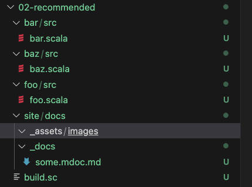

# Some doc

The way scaladoc manages image paths is a bit odd...

Correct for it, in order to allow




```scala mdoc
import foo.Foo
import bar.Bar
import baz.Baz

val fooey = Foo.foo
val barey = Bar.bar
val bazey = Baz.baz

```