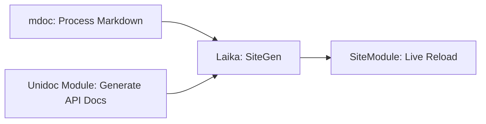

# Big Redesign

This was a deep rabbit hole.

The original take on this was custom and brittle. It's now deisgned into 4 modules which deal with their own concerns.

## Mdoc

Getting the classpath _right_ was painful. See here for inspiration:
https://github.com/hmf/mdocMill

The solution remains unsatisfactory in that I couldn't get the classpath right to consume mill as a library. See discussion here:

[mdoc as plugin](https://github.com/com-lihaoyi/mill/discussions/5733)

So it spins up it's own JVM every time, making it a little slower than necessary.

## Laika

I had no problem with Laika. It just worked.

## Live Reload

I wanted to use my own project;

[sjsls](https://github.com/Quafadas/live-server-scala-cli-js)

And have been happy with the outcome. For me live reload on change works reliably.

